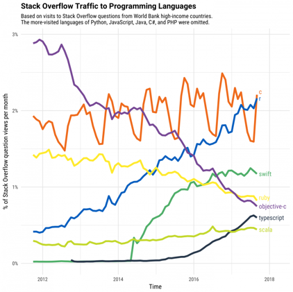

```{r setup, include=FALSE}
knitr::opts_chunk$set(echo = TRUE)
```


## By statisticians and academics for statisticians and academics


* R is developed  for statisticians by statisticians.

* Perfect for academics, researchers and students without any CS education

* Number 9 in TIOBE index for most popular programing languages (#22 in June 2019)

* Easy to read & follow syntax




[https://stackoverflow.blog/2017/10/10/impressive-growth-r/](https://stackoverflow.blog/2017/10/10/impressive-growth-r/) 

## Packages to your heart's desire


There is a plethora of packages that can be downloaded and used:


- CRAN package repository features 15,783 packages
    
  - **tidyverse**  by Hadley Wickham - compilation package for data manipulation and presentation

- GitHub has a large R community


- The statistician in the office next to you

And they are easy to install!

```{r eval = FALSE}
#CRAN
install_package('tidyverse')
#GitHub
library(devtools)
install_github("gretat/sdt.rmcs")
```

```{r message=FALSE, warning=FALSE}
meme::meme('1200px-Puking_Rainbows.jpg', "Packages", color = 'blue', size = 5, vjust = 0.05)
```


## The Tidy Universe  

```{r}
library(tidyverse)
```

## Scottish wellbeing and access to green and blue spaces


Lets' get some data from the Scottish Government at [statistics.gov.scot](https://statistics.gov.scot/data_home)

We want to explore how Scottish people experience mental wellbeing and is it related to how far they are from a park or the sea.

```{r data, message=FALSE}
green_blue <- read_csv("Distance to green or blue space- scottish household survey.csv")
wellbeing <- read_csv('Mental wellbeing- Scottish Surveys.csv')
geo_area <- read_csv('geo_area.csv')

```

## Lets have a quick look the acces to green and blue spaces data

There are variety of ways to preview a datases
```{r, message=FALSE }
#the straightforward way
head(green_blue)

#top N number of rows but not really useful with ties
top_n(wellbeing,10)


glimpse(geo_area)

```


## Tidying up

So let's tidy the data, because neither of the datasets are particularly easy to read or work with. This will also demonstrate the 'AND THEN' philosophy. 

```{r}
green_blue_tidy <- green_blue %>% # pick the dataset AND THEN
  filter(Gender == 'All',
         `SIMD quintiles` == 'All',
         `Urban Rural Classification` == 'All', 
         Age != 'All', 
         Measurement == 'Percent',
         `Distance to Nearest Green or Blue Space` != "Don't Know") %>% #filter in only useful and relevant data AND THEN
  inner_join(geo_area, by = 'FeatureCode') %>% #get names of the Scottish Councils AND THEN
  select(Value, Age, `Distance to Nearest Green or Blue Space`, DateCode, GeoArea, FeatureCode) %>% #keep only relevant variables AND THEN etc...
  rename(Percent_population = Value)

knitr::kable(green_blue_tidy[1:5,])
```

 - Data wrangling becomes straightforward 
 - It is easy to get into it

Now let's wrangle the wellbeing dataset to a similar format so we can play with it. Wrangling follows pretty much the same format almost all of the time. This is what makes it so easy for students to understand.


```{r}
#wellbeing
wellbeing_tidy <- wellbeing %>% 
  filter(Gender == 'All', 
         !Age %in% c('All', '16-64 years'), 
         `Type Of Tenure` == 'All',
         !`DateCode` %in% c('2014-2015', '2014-2017', '2016-2017'),
         Measurement == 'Mean') %>% 
  inner_join(geo_area, by = 'FeatureCode') %>% 
  select(Value, Age, DateCode, GeoArea, FeatureCode) %>% 
  mutate_at("DateCode", as.numeric) %>% 
  rename(Score= Value) 
```


Of course you can do a lot more with R, but if your wrangling is straight forward then the data analysis later is easier. 


## GGPLOT2: for your pretty plot


Now let's see how plotting works: 

**ggplot2** comes with **tidyverse** and makes lovely plots. It is the same layering pattern.

```{r, warning=FALSE, message=FALSE}

ggplot(filter(green_blue_tidy, GeoArea %in% c('Glasgow City', 'City of Edinburgh' , 'Highland')),
       aes(x = (DateCode-2000), y = Percent_population)) +  
  geom_point(aes(colour = `Distance to Nearest Green or Blue Space`), size = 2) +
  facet_grid(GeoArea~Age) +
  scale_x_continuous(breaks = c(13:18)) +
  scale_colour_discrete(name="Distance to Green/Blue Space",
                         breaks=c("A 5 minute walk or less", "Within a 6-10 minute walk", "An 11 minute walk or more"),
                         labels=c("5 min or less", "6-10 min", "11 min or more")) +
  theme_bw() +
  labs(y = "Percentage", x = "Year") +
  theme(axis.title = element_text(size = 12, colour = 'blue'),
        axis.text = element_text(size = 10), 
        strip.text = element_text(size = 11),
        legend.position = 'top',
        legend.text = element_text(size = 10),
        legend.title = element_text(size = 12))


ggplot(filter(wellbeing_tidy, GeoArea %in% c('Glasgow City', 'City of Edinburgh' , 'Highland')),
       aes(x = (DateCode-2000), y = Score)) +  
  geom_smooth(method = 'lm', se = FALSE) +
  geom_point(size = 2) +
  facet_grid(GeoArea~Age) +
  theme_bw() +
  labs(y = "Mental Wellbeing Score", x = "Year") +
  scale_y_continuous(breaks = c(23:27),limits = c(23,27))+
  scale_x_continuous(breaks = c(13:17)) +
  theme(axis.title = element_text(size = 12, colour = 'blue'),
        axis.text = element_text(size = 10), 
        strip.text = element_text(size = 11))
```

## The statistics
* Easy to read statistical output!

* Scottish people's mental wellbeing reduces through the years! 

* Is the change statistically significant?

* Is living closer to the sea (5 min or less) related ?


Lets remove overall Scotland data first and add proportion of people living near a park or the sea.

*Note: Data is not available for every area, every year for both datasets*  


```{r}

wellbeing_bg <- filter(wellbeing_tidy, GeoArea != 'Scotland') %>% 
 inner_join(green_blue_tidy, by = c('Age', 'FeatureCode', 'DateCode', 'GeoArea')) %>% 
  filter(`Distance to Nearest Green or Blue Space` == 'A 5 minute walk or less') %>% 
  select(-`Distance to Nearest Green or Blue Space`) %>% 
  mutate_at(c('Score', 'Percent_population'), scale)


summary(lm(Score ~ DateCode*Percent_population, data = wellbeing_bg))

#and in ANOVA terms
#Type-III variance decomposition - Simultaneous testing of effects

car::Anova(lm(Score ~ DateCode*Percent_population, data = wellbeing_bg), type = 'III') 
```

Yikes! We need more yoga!

## Plot it on a map

Is wellbeing location based?

Let's make a map of Scotland and see how wellbeing changes through the years. 

```{r message = FALSE, error = FALSE}
library(tmap)
library(tmaptools)
#get shape file
scot <-  sf::read_sf("SG_SIMD_2016.shp") #data: https://www2.gov.scot/Topics/Statistics/SIMD

#add data we have to shape file
scot_wellbeing <- left_join(scot, filter(wellbeing_tidy, Age == '35-64 years'), by = c("LAName"='GeoArea'))

well <- tm_shape(scot_wellbeing) + # Layer 1. what is our shape
  tm_fill(col = 'Score', # Layer2 : fill or colour based on the Attending Education column
          palette = 'div')+ # choose a palette
  tm_style("cobalt") +
  tm_layout(legend.width = 2) +
  tm_facets(along = 'DateCode', free.scales.symbol.size = FALSE, nrow=1,ncol=1) # choose a facet
```

```{r eval=FALSE}
tmap_animation(well, filename = "well_anim.gif", delay = 80, loop = TRUE, width=1200)
```


## Greenhouse gases and birds

There are no limitations with plots

Do you want to make a plot that shows you are a fan of birds? 

Get an image of the internet and use it to plot bird feathers! 
There is a package for that: `ggimage`

```{r message=FALSE}
library(ggimage)
#more data from statistics.gov.scot
greenhouse_gas <- read_csv('Greenhouse Gas emissions by source sector.csv')
birds <- read_csv('Terestrial breeding birds.csv')

#greenhouse gas

greenhouse_gas_tidy <- greenhouse_gas %>% # select the data AND THEN
  filter(Pollutant == 'CO2') %>% 
  inner_join(geo_area, by = 'FeatureCode') %>% 
  select(Value, `Greenhouse gas source sector`, DateCode, GeoArea) %>% 
  rename(Co2_count= Value) %>% 
  arrange(DateCode)

birds_tidy <- birds %>% 
   select(Value, DateCode) %>% 
  rename(count_base1994 = Value) %>% 
  arrange(DateCode)

green_bird <- inner_join(birds_tidy, greenhouse_gas_tidy, by = 'DateCode') %>% 
  mutate(img = 'feather.png')


ggplot(filter(green_bird, DateCode %in% c(2005:2014))) + 
  geom_col(aes(x = as.character(DateCode), y= Co2_count, fill = `Greenhouse gas source sector`)) +
  geom_image(aes(as.character(DateCode), y = count_base1994, image = img)) +
  theme_bw()+
  labs(y = "CO2 Emissions/Terestrial bird population", x = "Year") +
  theme(axis.title.x = element_text(size = 12, colour = 'blue'),
        axis.text = element_text(size = 10), 
        legend.text = element_text(size = 11),
        legend.title = element_text(size = 12),
        legend.position = 'bottom')
```


# The End

```{r fig.height=10, fig.width=20, fig.align = 'center', warning=FALSE}
meme::meme('success-kid-300x199.jpg', "Learned R", "Used it every day!", color = 'blue', size = 7, vjust = 0.2)
```


### Package references


Fox J. and Weisberg S. (2019). *An {R} Companion to Applied Regression*, Third Edition. Thousand Oaks CA: Sage. URL:  https://socialsciences.mcmaster.ca/jfox/Books/Companion/


Pebesma, E., (2018). Simple Features for R: Standardized Support for Spatial Vector Data. _The R Journal_, *10* (1), 439-446,
  https://doi.org/10.32614/RJ-2018-009

Tennekes M (2018). “tmap: Thematic Maps in R.” _Journal of Statistical Software_, *84*(6), 1-39. doi: 10.18637/jss.v084.i06 (URL: https://doi.org/10.18637/jss.v084.i06).

Tennekes M (2020). tmaptools: Thematic Map Tools. R package version 3.0. https://CRAN.R-project.org/package=tmaptools


Wickham et al., (2019). Welcome to the tidyverse. _Journal of Open Source Software_, *4*(43), 1686, https://doi.org/10.21105/joss.01686
  
Yihui Xie (2020). knitr: A General-Purpose Package for Dynamic Report Generation in R. R package version 1.28.

Yihui Xie (2015). Dynamic Documents with R and knitr. 2nd edition. Chapman and Hall/CRC. ISBN  978-1498716963

Yihui Xie (2014). _knitr: A Comprehensive Tool for Reproducible Research in R_. In Victoria Stodden,  Friedrich Leisch and Roger D. Peng, editors,  Implementing Reproducible Computational Research.  Chapman and Hall/CRC. ISBN 978-1466561595

Yu, G. (2020). ggimage: Use Image in  'ggplot2'. R package version 0.2.8. https://CRAN.R-project.org/package=ggimage

Yu G. (2019). meme: Create Meme. R package version 0.2.2.  https://CRAN.R-project.org/package=meme

