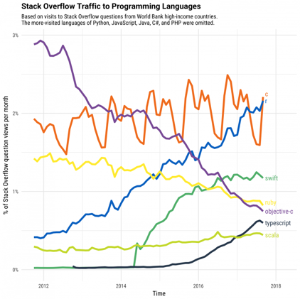
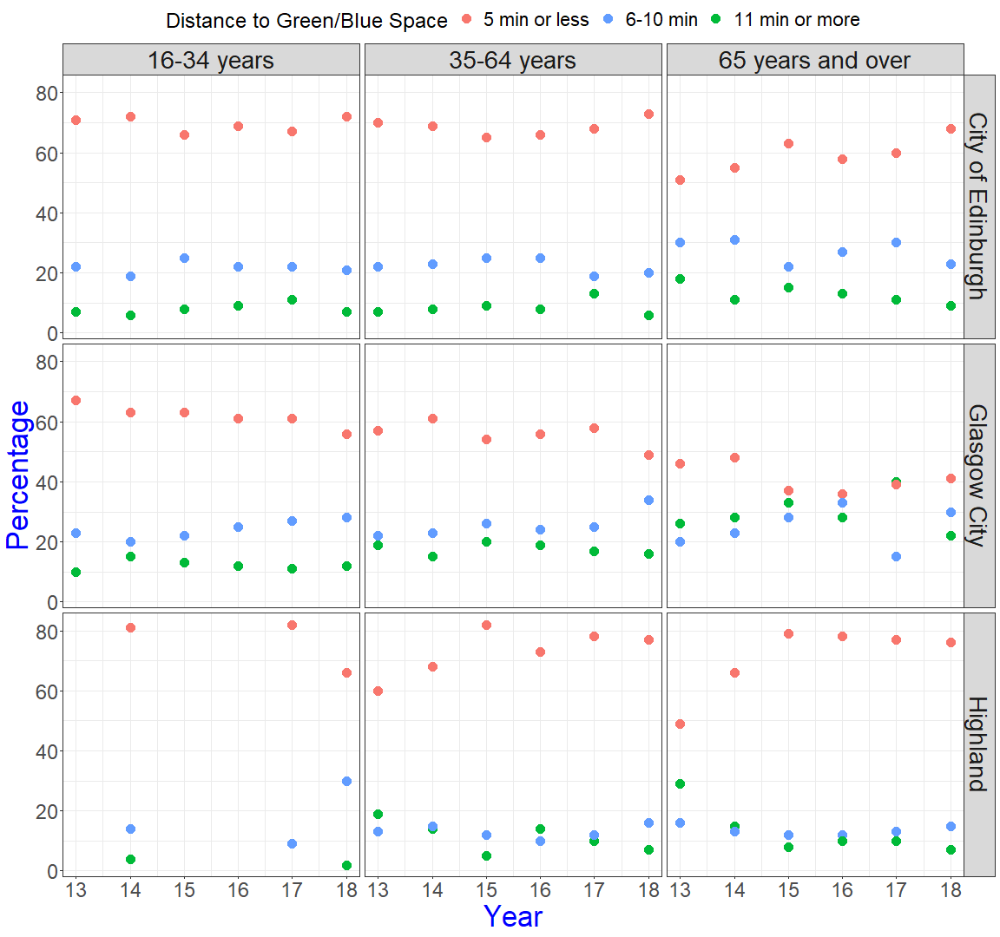
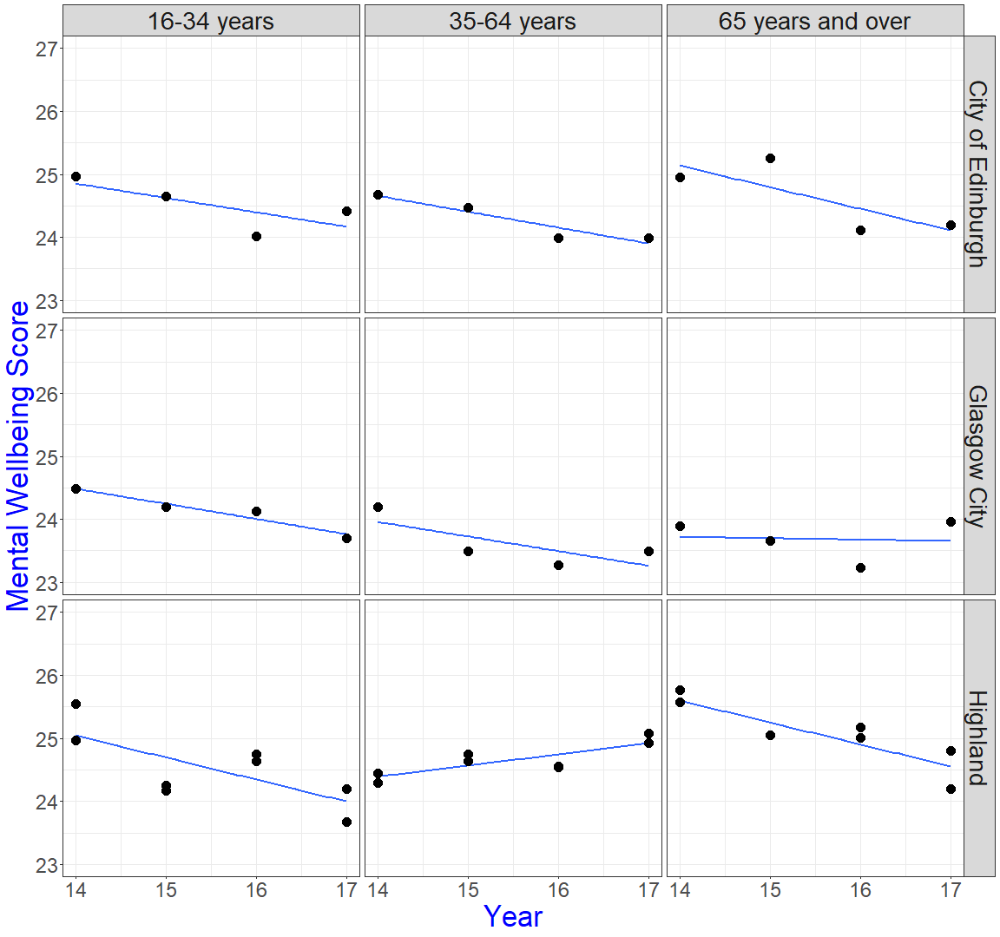
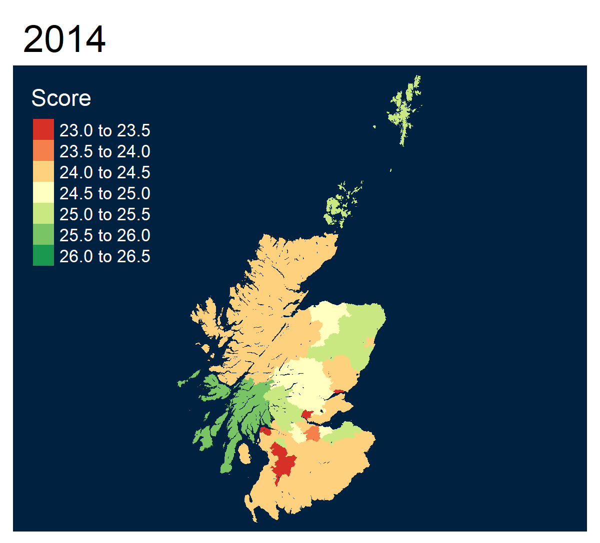
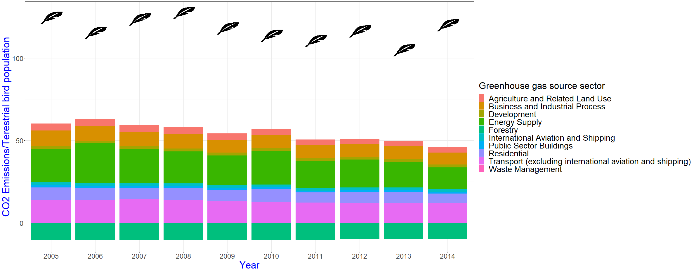

Rrrr - From the ease of data wrangling through the beauty of plots, to the joy of ShinyApps
========================================================
author: Greta Todorova, PhD candidate, University of Glasgow
date: 17/06/2020
font-import: https://fonts.googleapis.com/css2?family=Roboto
font-family: 'Roboto'
width: 1920
height: 900


<style>
.small-code pre code {
  font-size: 1em;
}
</style>


By statisticians and academics for statisticians and academics
========================================================

* R is developed  for statisticians by statisticians.

* Perfect for academics, researchers and students without any CS education

* Number 9 in TIOBE index for most popular programing languages (#22 in June 2019)

* Easy to read & follow syntax


***


[https://stackoverflow.blog/2017/10/10/impressive-growth-r/](https://stackoverflow.blog/2017/10/10/impressive-growth-r/) 

Packages to your heart's desire
========================================================
left: 70%

There is a plethora of packages that can be downloaded and used:


- CRAN package repository features 15,783 packages
    
- GitHub has a large R community


- The statistician in the office next to you

And they are easy to install!


```r
#CRAN
install_package('tidyverse')
#GitHub
library(devtools)
install_github("gretat/sdt.rmcs")
```

***

```r
meme::meme('1200px-Puking_Rainbows.jpg', "Packages", color = 'blue', size = 5, vjust = 0.05)
```


The Tidy Universe
========================================================

**tidyverse**  by Hadley Wickham

A compilation package for data manipulation and presentation


```r
library(tidyverse)
```

```
-- Attaching packages -------------------------------------------------------------------------------- tidyverse 1.3.0 --
```

```
v ggplot2 3.3.1     v purrr   0.3.4
v tibble  3.0.1     v dplyr   1.0.0
v tidyr   1.1.0     v stringr 1.4.0
v readr   1.3.1     v forcats 0.5.0
```

```
-- Conflicts ----------------------------------------------------------------------------------- tidyverse_conflicts() --
x dplyr::filter() masks stats::filter()
x dplyr::lag()    masks stats::lag()
```


Scottish wellbeing and access to green and blue spaces
========================================================

Lets' get some data from the Scottish Government at [statistics.gov.scot](https://statistics.gov.scot/data_home)

We want to explore how Scottish people experience mental wellbeing and is it related to how far they are from a park or the sea.


```r
green_blue <- read_csv('Distance to green or blue space- scottish household survey.csv')
geo_area <- read_csv('geo_area.csv')
wellbeing <- read_csv('Mental wellbeing- Scottish Surveys.csv')

head(green_blue[1:4,])
```

```
# A tibble: 4 x 13
  FeatureCode DateCode Measurement Units Value `Distance to Ne~ Age   Gender
  <chr>          <dbl> <chr>       <chr> <dbl> <chr>            <chr> <chr> 
1 S12000050       2013 95% Upper ~ Perc~   2.6 Don't Know       35-6~ All   
2 S92000003       2018 95% Lower ~ Perc~   1.7 Don't Know       All   All   
3 S12000013       2017 95% Lower ~ Perc~   0   Don't Know       35-6~ All   
4 S12000041       2018 95% Upper ~ Perc~   3.6 Don't Know       All   Female
# ... with 5 more variables: `Urban Rural Classification` <chr>, `SIMD
#   quintiles` <chr>, `Type Of Tenure` <chr>, `Household Type` <chr>,
#   Ethnicity <chr>
```


Wrangling data is easy as saying "AND THEN"
========================================================

The data looks okay, but it has so much unnecessary information.
Every function following a pipe '%>%' reads as a continuation of a long setence:

- Pick your dataset *AND THEN* ...
- filter in only desired information, *AND THEN* ...
- join with `geo_area` to get council names etc.


```r
green_blue_tidy <- green_blue %>% # pick the dataset AND THEN
  filter(Gender == 'All',
         `SIMD quintiles` == 'All',
         `Urban Rural Classification` == 'All', 
         Age != 'All', 
         Measurement == 'Percent',
         `Distance to Nearest Green or Blue Space` != "Don't Know") %>% #filter in only useful and relevant data AND THEN
  inner_join(geo_area, by = 'FeatureCode') %>% #get names of the Scottish Councils AND THEN
  select(Value, Age, `Distance to Nearest Green or Blue Space`, DateCode, GeoArea, FeatureCode) %>% #keep only relevant variables AND THEN etc...
  rename(Percent_population = Value)
```

Let's see how it looks
========================================================


| Percent_population|Age               |Distance to Nearest Green or Blue Space | DateCode|GeoArea           |FeatureCode |
|------------------:|:-----------------|:---------------------------------------|--------:|:-----------------|:-----------|
|                 68|65 years and over |A 5 minute walk or less                 |     2014|South Ayrshire    |S12000028   |
|                 80|35-64 years       |A 5 minute walk or less                 |     2017|Shetland Islands  |S12000027   |
|                 66|16-34 years       |A 5 minute walk or less                 |     2014|South Lanarkshire |S12000029   |

 - Data wrangling becomes straightforward 
 - It is easy to get into it
 

Here is the same for the wellbeing data. Same pattern!


```r
wellbeing_tidy <- wellbeing %>% 
  filter(Gender == 'All', 
         !Age %in% c('All', '16-64 years'), 
         `Type Of Tenure` == 'All',
         !`DateCode` %in% c('2014-2015', '2014-2017', '2016-2017'),
         Measurement == 'Mean') %>% 
  inner_join(geo_area, by = 'FeatureCode') %>% 
  select(Value, Age, DateCode, GeoArea, FeatureCode) %>% 
  mutate_at("DateCode", as.numeric) %>% 
  rename(Score= Value) 
```

GGPLOT2: for your pretty plot
========================================================

Now let's see how plotting works: 

**ggplot2** comes with **tidyverse** and makes lovely plots. It is the same layering pattern.


```r
ggplot(filter(green_blue_tidy, GeoArea %in% c('Glasgow City', 'City of Edinburgh', 'Highland')),
       aes(x = (DateCode-2000), y = Percent_population)) +  
  geom_point(aes(colour = `Distance to Nearest Green or Blue Space`), size = 5) +
  facet_grid(GeoArea ~ Age) +
  scale_x_continuous(breaks = c(13:18)) +
  scale_colour_discrete(name = "Distance to Green/Blue Space",
                        breaks = c("A 5 minute walk or less", "Within a 6-10 minute walk", "An 11 minute walk or more"),
                        labels = c("5 min or less", "6-10 min", "11 min or more")) +
  theme_bw() +
  labs(y = "Percentage", x = "Year") +
  theme(axis.title = element_text(size = 34, colour = 'blue'),
        axis.text = element_text(size = 24), 
        strip.text = element_text(size = 28),
        legend.position = 'top',
        legend.text = element_text(size = 22),
        legend.title = element_text(size = 24))
```


Now the plots
========================================================


***


The statistics
========================================================
class: small-code


* Easy to read statistical output!

*Scottish people's mental wellbeing reduces through the years! 

* Is the change statistically significant?

* Is living closer to the sea (5 min or less) related ?


Lets remove overall Scotland data first and add proportion of people living near a park or the sea.
*Note: Data is not available for every area, every year for both datasets* 


```r
wellbeing_bg <- filter(wellbeing_tidy, GeoArea != 'Scotland') %>%
  inner_join(green_blue_tidy, by = c('Age', 'FeatureCode', 'DateCode', 'GeoArea')) %>% 
  filter(`Distance to Nearest Green or Blue Space` == 'A 5 minute walk or less') %>% 
  select(-`Distance to Nearest Green or Blue Space`) %>% 
  mutate_at(c('Score', 'Percent_population'), scale)
```

***
Yikes! We need more yoga!


```r
summary(lm(Score ~ DateCode*Percent_population, data = wellbeing_bg)) 
```

```

Call:
lm(formula = Score ~ DateCode * Percent_population, data = wellbeing_bg)

Residuals:
    Min      1Q  Median      3Q     Max 
-2.5932 -0.6531 -0.0632  0.6044  4.2773 

Coefficients:
                             Estimate Std. Error t value Pr(>|t|)  
(Intercept)                 234.78366  100.20544   2.343   0.0198 *
DateCode                     -0.11649    0.04972  -2.343   0.0198 *
Percent_population          136.00528  100.48591   1.353   0.1769  
DateCode:Percent_population  -0.06742    0.04986  -1.352   0.1773  
---
Signif. codes:  0 '***' 0.001 '**' 0.01 '*' 0.05 '.' 0.1 ' ' 1

Residual standard error: 0.9827 on 309 degrees of freedom
Multiple R-squared:  0.0436,	Adjusted R-squared:  0.03432 
F-statistic: 4.696 on 3 and 309 DF,  p-value: 0.003194
```

Is wellbeing location based?
========================================================
Let's make a map of Scotland and see how wellbeing changes through the years. 

Again, exactly the same layering method as before! 


```r
library(tmap)
library(tmaptools)
#get shape file
scot <-  sf::read_sf("SG_SIMD_2016.shp") #data: https://www2.gov.scot/Topics/Statistics/SIMD

#add data we have to shape file
scot_wellbeing <- left_join(scot, filter(wellbeing_tidy, Age == '35-64 years'), by = c("LAName"='GeoArea'))

well <- tm_shape(scot_wellbeing) + # Layer 1. what is our shape
  tm_fill(col = 'Score', # Layer2 : fill or colour based on the Attending Education column
          palette = 'div') + # choose a palette
  tm_style("cobalt") +
  tm_layout(legend.width = 2) +
  tm_facets(along = 'DateCode', free.scales.symbol.size = FALSE, nrow=1,ncol=1) # choose a facet
```


The map
========================================================


```r
tmap_animation(well, filename = "well_anim.gif", delay = 80, loop = TRUE, width=1200)
```
***




There are no limitations with plots
========================================================

Do you want to make a plot that shows you are a fan of birds? 

Get an image of the internet and use it to plot bird feathers! 
There is a package for that: `ggimage`



ShinyApps
========================================================


*The world of apps, where you do not have to know much programming to be able to create your own application.*

It is all done in one script (or 2, depending on philosophy).

A simple ShinyApp example from [RStudio](https://shiny.rstudio.com/gallery/tabsets.html)

ShinyApps
========================================================


From simple apps 
- Plot about the popularity of your name in [Scottish National Records](https://scotland.shinyapps.io/nrs-baby-names/)

- [Effect size calculators](https://doomlab.shinyapps.io/mote/?_ga=2.49190563.445210606.1592039139-1894195279.1592039139) by Erin Buchanan

To more complex ones:

- Map of UK with April 2020 incidences of crime by city by Paul Campbell: [Crime Watch](https://cultureofinsight.shinyapps.io/crime-watch/?_ga=2.45504033.445210606.1592039139-1894195279.1592039139)

- Scottish Government's [Energy Statistics Dashboard](https://scotland.shinyapps.io/sg-scottish-energy-statistics/?Section=Covid19&Chart=C19Survey)
 


If you need more convincing:
========================================================

The joy of **RStudio**: 


- Easy to use IDE, which incorporates:

  - RMarkdown: beautiful, reproducible, easy reports

  - Integration with ShinyApps

  - R Notebooks 
  
  - [R Bookdown](https://gabymahrholz.github.io/Intro_to_R/data-visualisation-1.html) - perfect for teaching

  - This presentation
  
  - R projects

The End
========================================================
title:false

```r
meme::meme('success-kid-300x199.jpg', "Learned R", "Used it every day!", color = 'blue', size = 7, vjust = 0.2)
```


All materials available at: [https://github.com/gretat/py_data_sofia2020](https://github.com/gretat/py_data_sofia2020)

Package references
========================================================

Pebesma, E., (2018). Simple Features for R: Standardized Support for Spatial Vector Data. _The R Journal_, *10* (1), 439-446,
  https://doi.org/10.32614/RJ-2018-009

Tennekes M (2018). “tmap: Thematic Maps in R.” _Journal of Statistical Software_, *84*(6), 1-39. doi: 10.18637/jss.v084.i06 (URL: https://doi.org/10.18637/jss.v084.i06).

Tennekes M (2020). tmaptools: Thematic Map Tools. R package version 3.0. https://CRAN.R-project.org/package=tmaptools


Wickham et al., (2019). Welcome to the tidyverse. _Journal of Open Source Software_, *4*(43), 1686, https://doi.org/10.21105/joss.01686
  
Yihui Xie (2020). knitr: A General-Purpose Package for Dynamic Report Generation in R. R package version 1.28.

Yihui Xie (2015). Dynamic Documents with R and knitr. 2nd edition. Chapman and Hall/CRC. ISBN  978-1498716963

Yihui Xie (2014). _knitr: A Comprehensive Tool for Reproducible Research in R_. In Victoria Stodden,  Friedrich Leisch and Roger D. Peng, editors,  Implementing Reproducible Computational Research.  Chapman and Hall/CRC. ISBN 978-1466561595

Yu, G. (2020). ggimage: Use Image in  'ggplot2'. R package version 0.2.8. https://CRAN.R-project.org/package=ggimage

Yu G. (2019). meme: Create Meme. R package version 0.2.2.  https://CRAN.R-project.org/package=meme
